# 계산영상시스템 Homework #3 : Implementation Poisson Blending
# 전기전자공학부 2020314086 이정행


## Main code 'stater.m'
Through the process of cropping, the part to be used in the source image can be obtained. 

<p align='center'>
  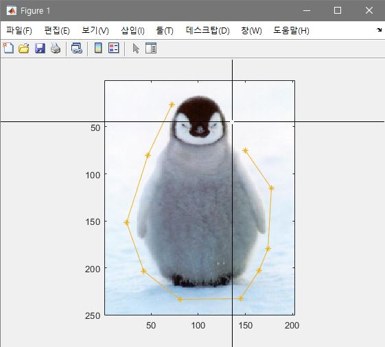
</p>

It will be combined like this

<p align='center'>
  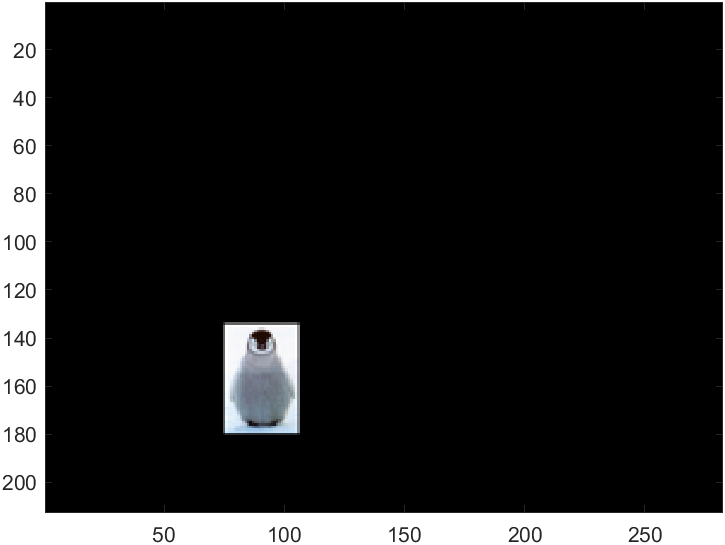
  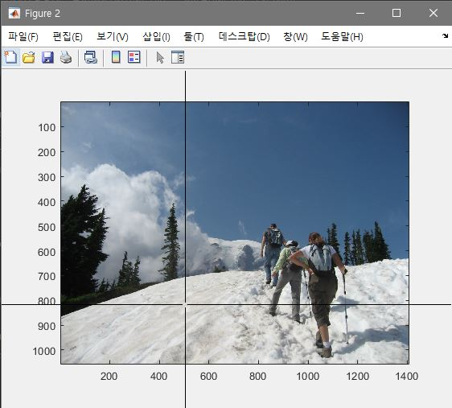
</p>

``` matlab
% starter script for project 3
clc; clear all;
DO_TOY = false;
DO_BLEND = true;
DO_MIXED  = true;
DO_COLOR2GRAY = false;


if DO_TOY 
    toyim = im2double(imread('G:/수업/수강/[2-1]계산영상시스템/hw/3/data/toy_problem.png')); 
    % im_out should be approximately the same as toyim
    im_out = toy_reconstruct(toyim);
    disp(['Error: ' num2str(sqrt(sum(toyim(:)-im_out(:))))])
end

if DO_BLEND
    im_background = imresize(im2double(imread('G:/수업/수강/[2-1]계산영상시스템/hw/3/data/hiking.jpg')), 0.5, 'bilinear');
    im_object = imresize(im2double(imread('G:/수업/수강/[2-1]계산영상시스템/hw/3/data/penguin-chick.jpeg')), 0.5, 'bilinear');

    % get source region mask from the user
    objmask = getMask(im_object);
    % align im_s and mask_s with im_background
    [im_s, mask_s] = alignSource(im_object, objmask, im_background);

    % blend
    im_blend = poissonBlend(im_s, mask_s, im_background);
    figure(3), hold off, imshow(im_blend)
end

if DO_MIXED
    % read images
    %...
    
    % blend
    im_blend = mixedBlend(im_s, mask_s, im_background);
    figure(3), hold off, imshow(im_blend);
end

if DO_COLOR2GRAY
    im_rgb = im2double(imread('./samples/colorBlindTest35.png'));
    im_gr = color2gray(im_rgb);
    figure(4), hold off, imagesc(im_gr), axis image, colormap gray
end

```

## Toy problem
Using 'toy_problem.png'. 
Compute the x and y gradient, recontruct an image v
 
```matlab
%% function of toy_reconstruction in starter.m
function output = toy_reconstruct(toyim)

img = toyim;
[imh, imw, nn] = size(img);
im2var = zeros(imh, imw);
im2var(1:imh*imw) = 1: imh*imw;

A = sparse(imh*(imw-1) + imw*(imh-1) + 1, imh*imw);

b = zeros(imh*imw, nn);
e = 0;

for i = 1:imh
    for j = 1:imw-1
        e = e+1;
        A(e, im2var(i,j+1)) = 1;
        A(e, im2var(i,j)) = -1;
        b(e) = img(i,j+1) - img(i,j);
    end
end

for j = 1:imw
    for i = 1:imh-1
        e = e+1;
        A(e, im2var(i+1,j)) = 1;
        A(e, im2var(i,j)) = -1;
        b(e) = img(i+1,j) - img(i,j);
    end
end

e = e+1;
A(e, im2var(1,1)) = 1;
b(e) = img(1,1);


v = A \ b;
output = reshape(v, [imh, imw]);

end
```

###Results

<figure role="group"  align='center'>
    <figure>
        
        <figcaption>Original image</figcaption>
    </figure>
    <figure>
        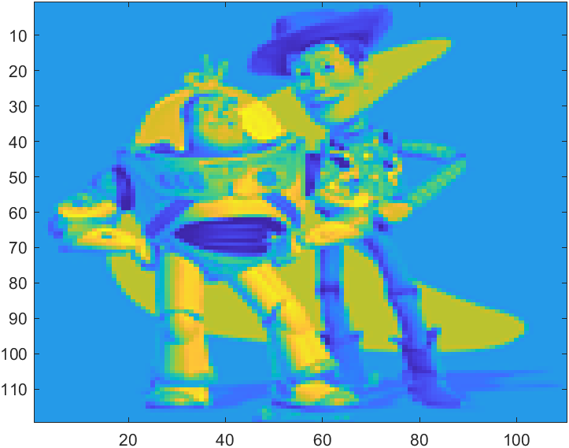
        <figcaption>Result</figcaption>
    </figure>
</figure>

## Poisson blending 

Put penguins into hiking image. 

```matlab
function im_blend = poissonBlend(source, mask_s, im_background)

target = imresize(im_background, 0.2);
source = imresize(source, 0.2);

mask = imresize(mask_s, 0.2);

[im_s2, mask_] = alignSource(source, mask, target);

[H, W, c] = size(im_s2);
im2var = zeros(H, W);
im2var(1:H*W) = 1:H*W;

counter=0;
A = sparse(H*W, H*W);
b = zeros(H*W, c);

for i=1:H
    for j=1:W
        counter = counter+1;
        if mask_(i,j) == 0 
            A(counter,im2var(i,j)) = 1;
            b(counter,:) = target(i,j,:);
        else
            A(counter,im2var(i,j)) = 4;
            A(counter,im2var(i,j-1)) = -1;
            A(counter,im2var(i,j+1)) = -1;
            A(counter,im2var(i-1,j)) = -1;
            A(counter,im2var(i+1,j)) = -1;
            b(counter,:) = 4*im_s2(i,j,:)-im_s2(i,j-1,:)-im_s2(i,j+1,:)-im_s2(i-1,j,:)-im_s2(i+1,j,:);
        end
    end
end

v = A\b;

im_blend = reshape(v, H, W, c);
                
end
```
### Penguin 1
<figure role="group"  align='center'>
    <figure>
        
        <figcaption>Original penguin</figcaption>
    </figure>
    <figure>
        
        <figcaption>Background image</figcaption>
    </figure>
    <figure>
        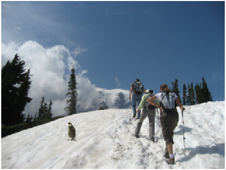
        <figcaption>Blended result</figcaption>
    </figure>
</figure>
    
### Penguin 2
<figure role="group"  align='center'>
    <figure>
        
        <figcaption>Original penguin 2</figcaption>
    </figure>
    <figure>
        
        <figcaption>Background image</figcaption>
    </figure>
    <figure>
        
        <figcaption>Blended result 2</figcaption>
    </figure>
</figure>


## Blending with mixed gradients
Following the same steps as Poisson blending, can apply mixed gradient case. 
```matlab
function im_blend = mixedBlend(im_s, mask_s, im_background)

[imh, imw, channel] = size(im_background); 
im2var = zeros(imh, imw);
im2var(1:imh*imw) = 1:imh*imw; 

A = sparse(2*imh*imw, imh*imw); 
b = zeros(2*imh*imw, 1); 

% get start and end cordinates of a rectangular mask from a customized mask region 
flag = 0;
for y = 1:imh
    for x = 1:imw
        if (flag == 0)
        if (mask_s(y,x)==1)
            x_min = x; y_min = y;
            x_max = x; y_max = y;    
            flag = 1;
        end    
        end
        if (mask_s(y,x)==1)
            if (x<x_min) 
                x_min = x;
            end
            if (y<y_min) 
                y_min = y;
            end
            if (x>x_max) 
                x_max = x;
            end
            if (y>y_min) 
                y_max = y;
            end
        end    
        
    end        
end
```

Mixed gradient blending
```matlab
for c=1:channel    
    counter=0;    
    a = 0;
    a_ = 0;
    for x=x_min:x_max
        x
        for y=y_min:y_max
            if(mask_s(y,x)==1)
                neighbor = [y,x+1;y+1,x;y,x-1;y-1,x];
                
                for k = 1:4
                    a = neighbor(k,1);
                    a_ = neighbor(k,2);
                    if(mask_s(a,a_)==1)
                        counter = counter+1;
                        A(counter, im2var(a,a_))=1;
                        A(counter, im2var(y,x))=-1;
                        b(counter) = max(im_s(a,a_,c)-im_s(y,x,c), im_background(a,a_,c)-im_background(y,x,c)); 
                    else     
                        counter=counter+1; 
                        A(counter, im2var(y,x+1))=0;
                        A(counter, im2var(y,x))=-1; 
                        b(counter) = max(im_s(a,a_,c)-im_s(y,x,c), im_background(a,a_,c)-im_background(y,x,c)) - im_background(a,a_,c);                 
                    end
                end
            end
        end  
    end
    v = A\b;
    final(:,:,c) = reshape(v,imh,imw); 
end  

mask(:,:,:)= cat(3, mask_s, mask_s, mask_s);

im_blend = mask.*final + (1-mask).*im_background;


end
```
### Penguin 1
<figure role="group"  align='center'>
    <figure>
        
        <figcaption>Original penguin</figcaption>
    </figure>
    <figure>
        
        <figcaption>Background image</figcaption>
    </figure>
    <figure>
        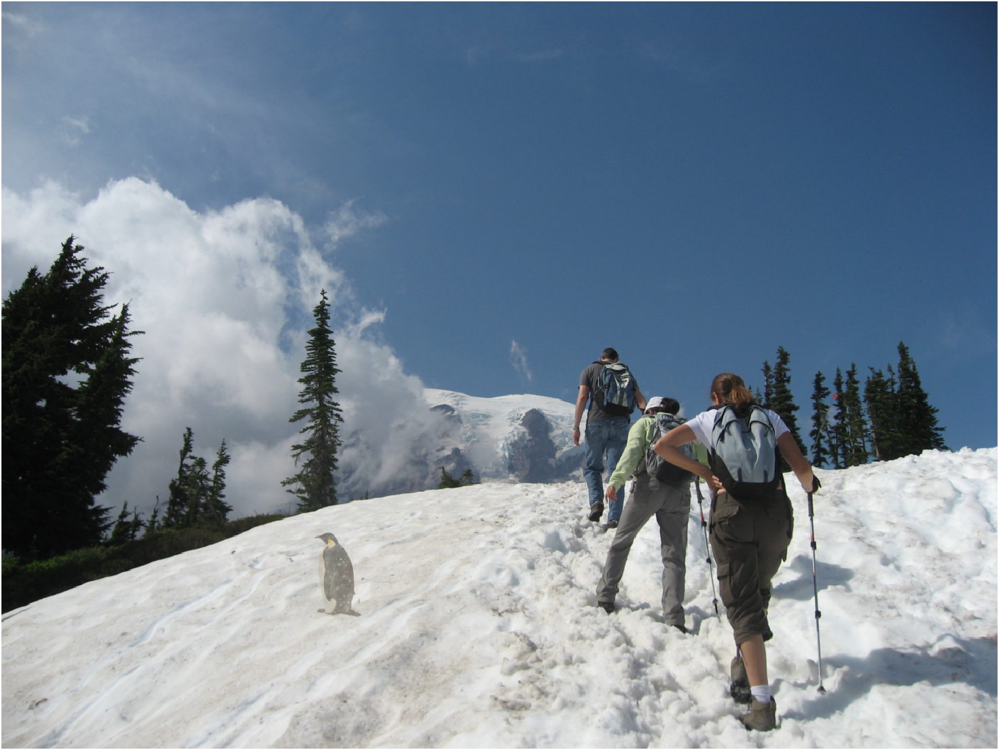
        <figcaption>Blended result</figcaption>
    </figure>
</figure>
    
### Penguin 2
<figure role="group"  align='center'>
    <figure>
        
        <figcaption>Original penguin 2</figcaption>
    </figure>
    <figure>
        
        <figcaption>Background image</figcaption>
    </figure>
    <figure>
        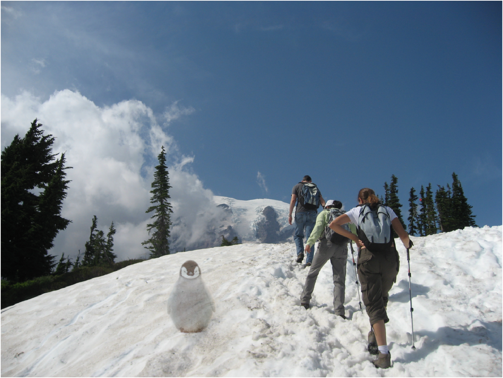
        <figcaption>Blended result 2</figcaption>
    </figure>
</figure>


## Your own examples
I applied 3 cased in this assignment. 
Apple with Lee, Classroom with a man holding a book, River scene with Jesus.


### Lee in Apple keynote
<figure role="group"  align='center'>
    <figure>
        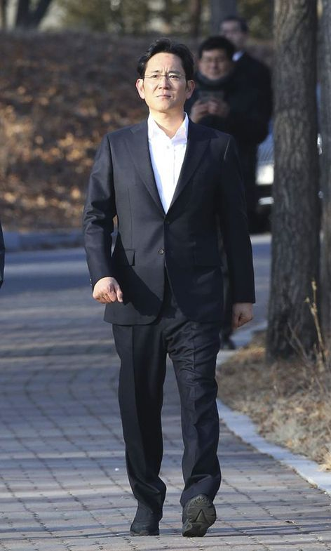
        <figcaption>Lee</figcaption>
    </figure>
    <figure>
        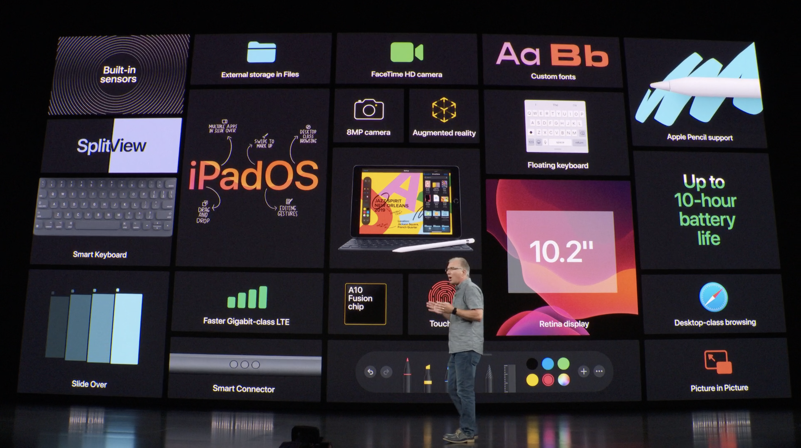
        <figcaption>Apple keynote</figcaption>
    </figure>
    <figure>
        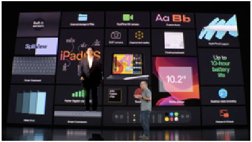
        <figcaption>Blended result : Poisson</figcaption>
    </figure>
        <figure>
        
        <figcaption>Blended result : Mixed Gradient</figcaption>
    </figure>
</figure>


### A man in classroom
<figure role="group"  align='center'>
    <figure>
        
        <figcaption>Teacher</figcaption>
    </figure>
    <figure>
        
        <figcaption>Empty classroom</figcaption>
    </figure>
    <figure>
        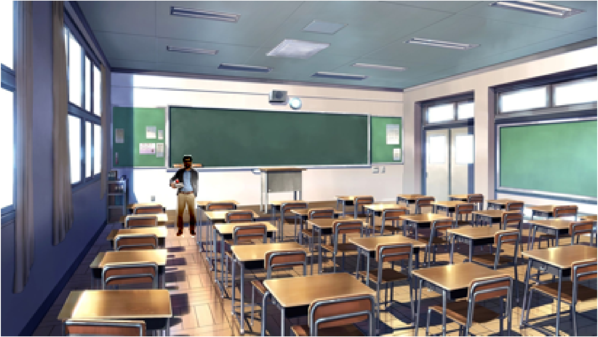
        <figcaption>Blended result : Poisson</figcaption>
    </figure>
        <figure>
        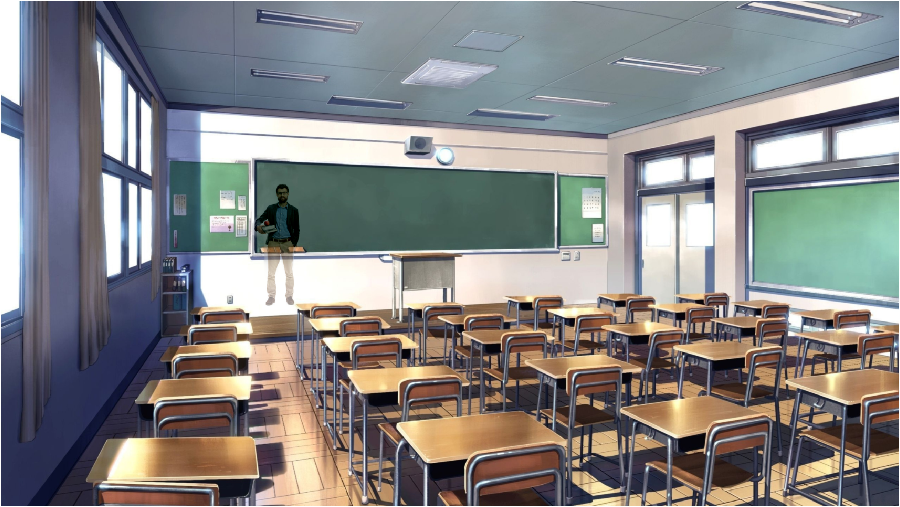
        <figcaption>Blended result : Mixed Gradient</figcaption>
    </figure>
</figure>

### Jesus on riverside
<figure role="group"  align='center'>
    <figure>
        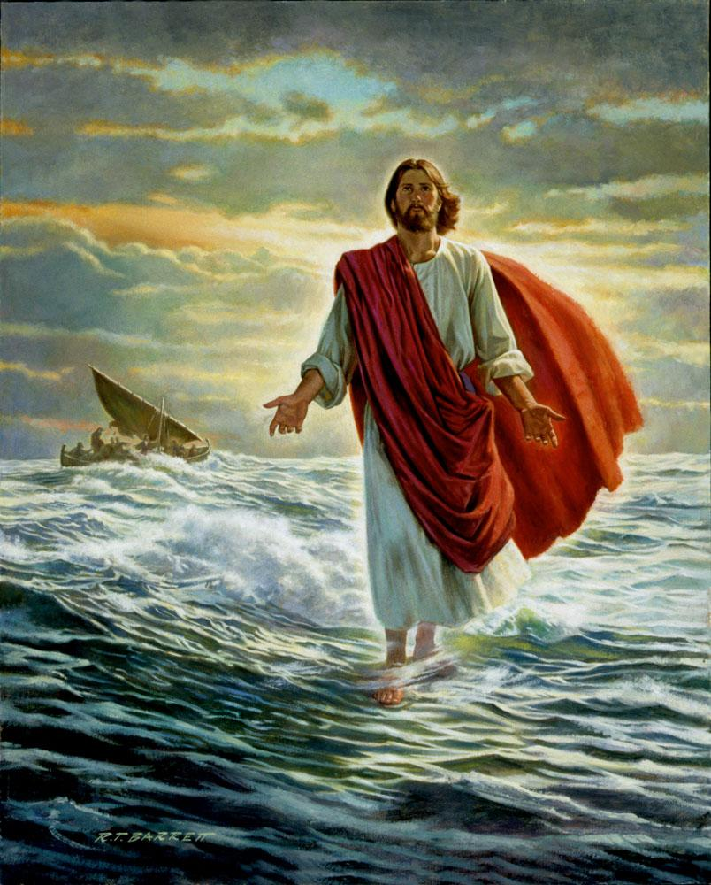
        <figcaption>Jesus</figcaption>
    </figure>
    <figure>
        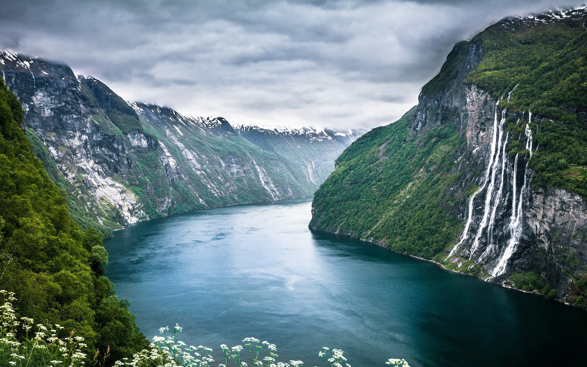
        <figcaption>Before Christ river</figcaption>
    </figure>
    <figure>
        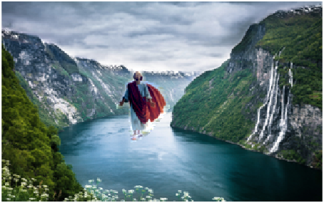
        <figcaption>Blended result : Poisson</figcaption>
    </figure>
        <figure>
        
        <figcaption>Blended result : Mixed Gradient</figcaption>
    </figure>
</figure>