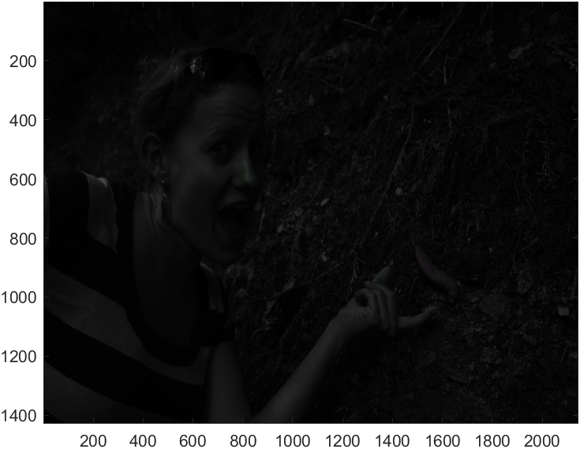
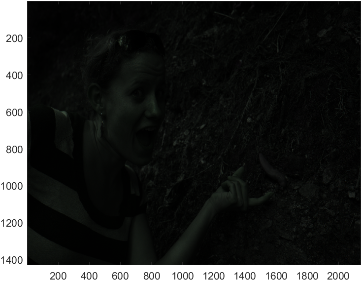
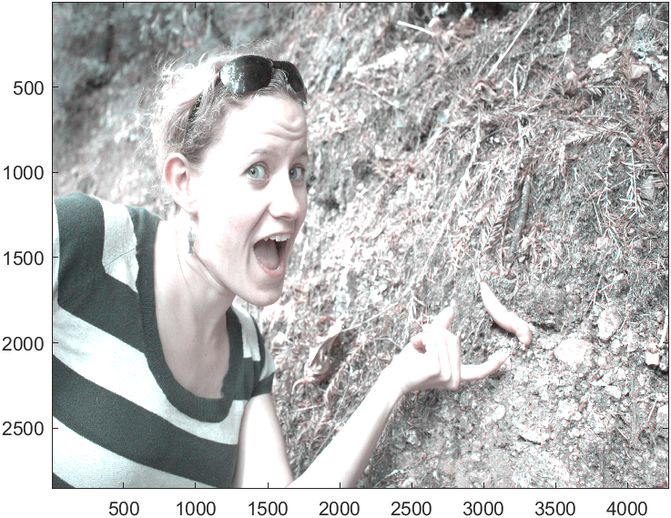
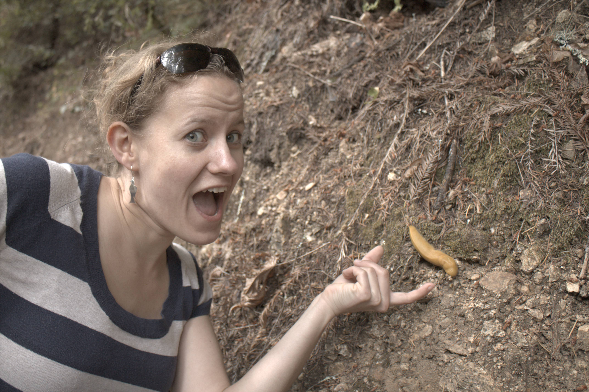
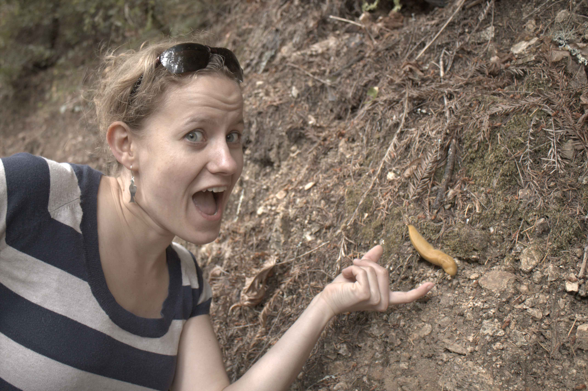
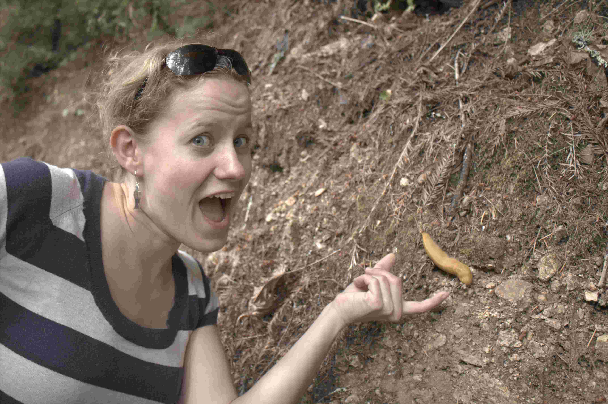
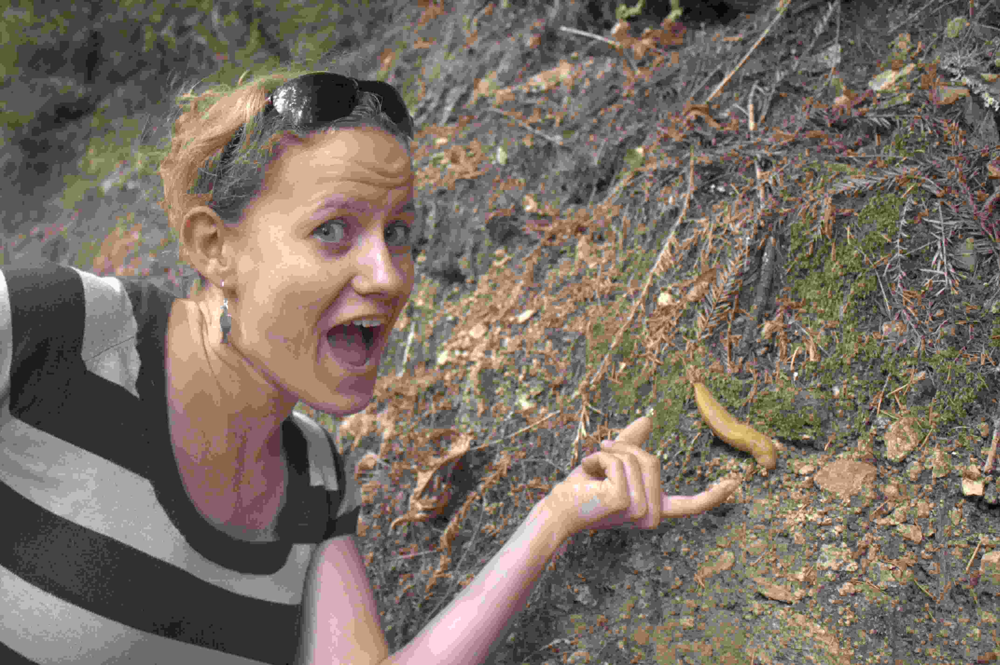

# 계산영상시스템 Homework #1 : Demosaic
# 전기전자공학부 2020314086 이정행
## Implementation a basic image processing pipeline

## Initials
Image read, convert to 2D-double array

```matlab
clc; clear all;

img_cr2 = imread('G:\수업\수강\[2-1]계산영상시스템\hw\1\assign1\data\banana_slug.cr2');
img_tiff = imread('G:\수업\수강\[2-1]계산영상시스템\hw\1\assign1\data\banana_slug.tiff');

% image size 
[H, W] = size(img_tiff);

class(img_tiff)
double_img = double(img_tiff);
```
## Linearization
Linear tranformation for img and clipping
```matlab
% Linearization into range [0,1] using linear transformation
norm_img = (double_img/(15000 - 2047)) - (2047 / (15000-2047));
% clipping
norm_img(norm_img<0) = 0;
norm_img(norm_img>1) = 1;
```

## Identifying the correct Bayer pattern
Comparing the four cases, it was determined that the given image has a pattern of rggb.
(Look at the color representation of banana slug. Original color of banana slug is almost yellow.)

```matlab
%% rggb
im_r = norm_img(1:2:end, 1:2:end);
im_b = norm_img(2:2:end, 2:2:end);
im_g_1 = norm_img(1:2:end, 2:2:end);
im_g_2 = norm_img(2:2:end, 1:2:end);

im_g = (im_g_1 + im_g_2) /2 ;
im_rgb = cat(3, im_r, im_g, im_b);
image(im_rgb)
```
bggr, gbrg, grbg, rggb

<p align='center'>
  
  
  
  
</p>

## White balancing
Two cases of white balancing : Gray world assumption & White world assumption

```matlab
%% white balancing
% gray world assumption

gray_bal_r = mean(im_g(:)) / mean(im_r(:)) * im_r;
gray_bal_g = im_g;
gray_bal_b = mean(im_g(:)) / mean(im_b(:)) * im_b;

gray_bal_im_rgb = cat(3, gray_bal_r, gray_bal_g, gray_bal_b);
figure()
image(gray_bal_im_rgb)

% white world assumption

white_bal_r = max(im_g(:)) / max(im_r(:)) * im_r;
white_bal_g = im_g ;
white_bal_b = max(im_g(:)) / max(im_b(:)) * im_b;

white_bal_im_rgb = cat(3, white_bal_r, white_bal_g, white_bal_b);
figure()
image(white_bal_im_rgb)
```

<p align='center'>
  
  
</p>

## Demosiacing
Bilinear interpolation for demosaicing. (using interp2 function in MatLab)

```matlab
%% demosaic

gray_interpol_r = interp2(gray_bal_r);
gray_interpol_g = interp2(gray_bal_g);
gray_interpol_b = interp2(gray_bal_g);
gray_interpol_im = 2.5 *  cat(3, gray_interpol_r, gray_interpol_g, gray_interpol_b);

white_interpol_r = interp2(white_bal_r);
white_interpol_g = interp2(white_bal_g);
white_interpol_b = interp2(white_bal_b);
white_interpol_im = cat(3, white_interpol_r, white_interpol_g, white_interpol_b);
```

## Brightness adjustment and gamma correction 

```matlab
%% Gamma

% brightness adjustment 
gray_interpol_im = gray_interpol_im * 3.15;
white_interpol_im = white_interpol_im * 3.15;

% gamma
gray = 0;
if gray
    interpol_r = gray_interpol_im(:,:,1);
    interpol_g = gray_interpol_im(:,:,2);
    interpol_b = gray_interpol_im(:,:,3);
else
    interpol_r = white_interpol_im(:,:,1);
    interpol_g = white_interpol_im(:,:,2);
    interpol_b = white_interpol_im(:,:,3);
end

[H,W,C] = size(gray_interpol_im);

for j = 1:W
    for i = 1:H
        if interpol_r(i, j) < 0.0031308
            interpol_r(i, j) = interpol_r(i,j) * 12.92;
        else
            interpol_r(i,j) = ((1 + 0.055) * interpol_r(i,j).^(1/2.4)) - 0.055;
        end
        
        if interpol_g(i, j) < 0.0031308
            interpol_g(i, j) = interpol_g(i,j) * 12.92;
        else
            interpol_g(i,j) = ((1 + 0.055) * interpol_g(i,j).^(1/2.4)) - 0.055;
        end
        
        if interpol_b(i, j) < 0.0031308
            interpol_b(i, j) = interpol_b(i,j) * 12.92;
        else
            interpol_b(i,j) = ((1 + 0.055) * interpol_b(i,j).^(1/2.4)) - 0.055;
        end
    end
end

gamma_img = cat(3, interpol_r, interpol_g, interpol_b);
figure()
image(gamma_img)
```
<p align='center'>
  
  
</p>

The result of white world assumption looks better.

## Compression
Compression was obviously obseved at 30 quality level setting.

```matlab
imwrite(gamma_interpol_im, 'out_img_95.png');
imwrite(gamma_interpol_im, 'out_img_95.jpeg', 'quality', 95);

imwrite(gamma_interpol_im, 'out_img_80.jpeg', 'quality', 80);
imwrite(gamma_interpol_im, 'out_img_70.jpeg', 'quality', 70);
imwrite(gamma_interpol_im, 'out_img_60.jpeg', 'quality', 60);
imwrite(gamma_interpol_im, 'out_img_50.jpeg', 'quality', 50);
imwrite(gamma_interpol_im, 'out_img_40.jpeg', 'quality', 40);
imwrite(gamma_interpol_im, 'out_img_30.jpeg', 'quality', 30);
imwrite(gamma_interpol_im, 'out_img_20.jpeg', 'quality', 20);
imwrite(gamma_interpol_im, 'out_img_10.jpeg', 'quality', 10);
imwrite(gamma_interpol_im, 'out_img_5.jpeg', 'quality', 5);
```

Comparison .png vs .jpeg

<p align='center'>
  
  
</p>


Demonstrated compression with various quality level \
 [95, 80, 70, 60, 50, 40, 30, 20 , 10 , 5]


(reference image) \
.png : 15.7MB
<p align='center'>
  
</p>

(compressed image)
.jpeg

<p align='center'>
  
</p>
compression quality : 95 \
3214KB (3.214MB) compression ratio : 24.47%

<p align='center'>
  
</p>
compression quality : 80\
3214KB (1.372MB) compression ratio : 8.73%

<p align='center'>
  
</p>
compression quality : 70 \
3214KB (1.063MB) compression ratio : 6.77%

<p align='center'>
  
</p>
compression quality : 60 \
883KB compression ratio : 5.62%

<p align='center'>
  
</p>
compression quality : 50 \
769KB compression ratio : 4.90%

<p align='center'>
  
</p>
compression quality : 40 \
666KB compression ratio : 4.24%

<p align='center'>
  
</p>
compression quality : 30 \
564KB compression ratio : 3.59%

<p align='center'>
  
</p>
compression quality : 20 \
449KB compression ratio : 2.86%

<p align='center'>
  
</p>
compression quality : 10 \
320KB compression ratio : 2.04%

<p align='center'>
  
</p>
compression quality : 5 \
247KB compression ratio : 1.57%


